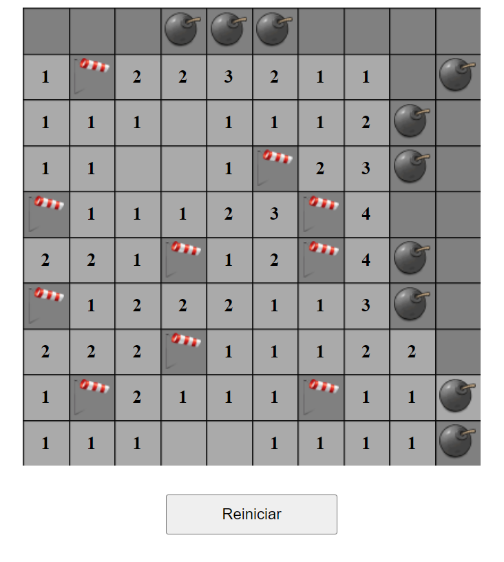

# Minesweeper Vanilla JS

---

### Description
A classic minesweeper made only with HTML CSS JS following along this great course from "Traversy Media" and "Code with Ania Kubów" when learning JS

[Traversy Media - Build Minesweeper with JavaScript](https://www.youtube.com/watch?v=W0No1JDc6vE&ab_channel=TraversyMedia)

[Code with Ania Kubów](https://www.youtube.com/c/AniaKub%C3%B3w)

---

## Author Info

- Linkedin - [Federico Andrés Jácome Castañeda](https://www.linkedin.com/in/federicojacome/)
- Website - [Portfolio](https://federocky.github.io/PersonalWeb/)

